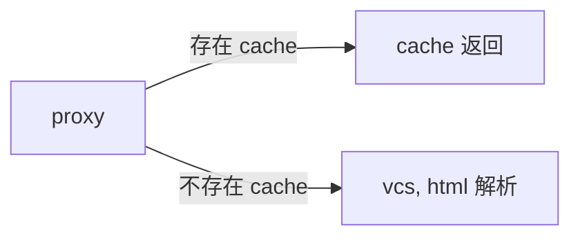
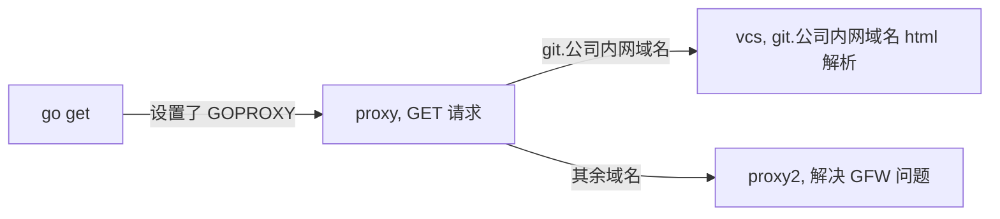

# Golang Module代理goproxy.io源码简析及改造

## 写在前面

此文写于大概 Go 1.12刚发布的时间，最早发表于前前司公司内网。此版本已经修改过，将前前司内部域名等删去了。放到现在，是一个 GOPRIVATE 就能解决的问题。此文放上来只是为了记录当时的思路。

## 背景及问题

众所周知，Golang经常被人诟病的一点是没有统一的包管理工具，开始只能依赖GOPATH和GOROOT的设置来进行；Golang 1.5版本后官方加入了vendor机制，于是glide（也是公司推行的）、godep、govendor等第三方管理工具也百花齐放。三方工具各有优劣，这里不展开对比；但这些三方工具没有哪一个能一统天下。这足以说明，仅仅依靠vendor机制上的三方工具，并不足够。

自Golang 1.11起，官方加入了Go Module实验特性，从此开发不需要再关注GOPATH或者vendor的设置；自1.12版本起，对Module进入了正式支持阶段。

在前前司某项目开发过程中，为了摆脱对GOPATH和vendor的依赖直接选用了正式支持Go Module特性的1.12版本，使用感受就两个字：省心。先看看第三方工具的使用体验：

1.需要先学习第三方工具怎么用、优缺点都是什么然后从里面挑一个，如果对于自己的应用没有考虑全面的话还容易挑错

2.不小心升级了不该升的包需要耗费巨大代价才能降回去

3.某些工具在处理多个package的时候，只要有一个失败就全部失败，导致操作极其繁琐且耗时（没错我说的就是glide）

而Go Module呢？网络通畅的情况下，go mod init然后go get就可以进入使用了，什么都不用操心，靠谱而且**省心**。

当然，Go Module并不是万能药，上面也强调了前提：网络通畅。所以使用的过程中碰到的最明显的问题是：**GFW以及公司内网环境隔离带来的代理切换问题**。

具体来说就是: 

1. 当go get显示无法获取包时，一般设置GOPROXY环境变量，通过代理来获取我们所需要的包。
2. 设置GOPROXY的情况下，代理无法获取到公司内部git.fakedomain.com域名下的包(因为外网代理不可能连得上内网)，此时需要关闭GOPROXY代理。
3. 1、2结合平时操作较为繁琐，且在公司编译机中编译时，要实现GOPROXY自动切换的功能，build.sh写起来较为麻烦。

于是自然想到解决办法：**在公司内部搭建一个可以通过package地址来自动切换内外网访问的GOPROXY代理**。

当前开源的Go Module的代理，用得较多的项目一般为goproxy.io和Athens，两者除开源代码外，也都提供已经搭建好的代理服务，个人用得较多的是Athes的代理。但从目标来看，改动goproxy.io更为简单直接。因此最终的改造基于了goproxy。

## Goproxy代码解析及改造

### 1. Go Module Proxy需要满足什么条件

以下内容摘自官方：

```
A Go module proxy is any web server that can respond to GET requests for
URLs of a specified form. The requests have no query parameters, so even
a site serving from a fixed file system (including a file:/// URL)
can be a module proxy.

The GET requests sent to a Go module proxy are:

GET $GOPROXY/<module>/@v/list returns a list of all known versions of the
given module, one per line.

GET $GOPROXY/<module>/@v/<version>.info returns JSON-formatted metadata
about that version of the given module.

GET $GOPROXY/<module>/@v/<version>.mod returns the go.mod file
for that version of the given module.

GET $GOPROXY/<module>/@v/<version>.zip returns the zip archive
for that version of the given module.

To avoid problems when serving from case-sensitive file systems,
the <module> and <version> elements are case-encoded, replacing every
uppercase letter with an exclamation mark followed by the corresponding
lower-case letter: github.com/Azure encodes as github.com/!azure.
```

就是说，任何实现了上述四个GET请求要求的Web服务，都可以作为Go Module Proxy。（更多细节可以go help goproxy查看)。

.info接口需求的JSON格式为:

```go
type Info struct {
    Version string    // version string
    Time    time.Time // commit time
}
```

因此，我们首先能断定，goproxy.io也满足上述要求，查看源码时，可以以web服务为入口开始理解。

### 2. goproxy.io的代码逻辑

#### 2.1 代码结构
刨除go.sum、dockerfile等文件，goproxy.io的目录结构很简单:

```
.
├── build
│   └── generate.sh
├── contrib
│   ├── README.md
│   └── goproxy.yml
├── docker-compose.yaml
├── main.go
├── proxy
│   └── proxy
│       ├── proxy.go
│       ├── proxy_test.go
│       └── response.go
├── scripts
│   ├── goproxy.service
│   └── index.html
└── test
    ├── get_test.sh
    └── testdata
        └── get.txt
```

### 2.2 main.go

先从main.go看起。对我们而言，入口为web服务，所以最关心的代码是下面这段：

```go
server := http.Server{
		Addr:    listen,
		Handler: proxy.NewProxy(cacheDir, &proxyInfo),
    }
```

此处说明对于所有的http请求，均由proxy.NewProxy()函数来处理，此部分也就是请求时的主要处理逻辑，于是看具体的逻辑

### 2.3 请求处理逻辑

#### 2.3.1 整体逻辑
看代码定义：

``` go
func NewProxy(cache string, proxyInfo *ProxyInfo) http.Handler {
	setupEnv(cache)

	cacheDir = filepath.Join(modfetch.PkgMod, "cache", "download")
	innerHandle = http.FileServer(http.Dir(cacheDir))

	return http.HandlerFunc(func(w http.ResponseWriter, r *http.Request) {
		log.Printf("goproxy: %s request %s\n", r.RemoteAddr, r.URL.Path)
		info, err := parseModInfoFromUrl(r.URL.Path)
		if err != nil {
			innerHandle.ServeHTTP(w, r)
			return
		}
		switch suf := info.suf; suf {
		case ".info", ".mod", ".zip":
			{
				if _, err := os.Stat(filepath.Join(cacheDir, r.URL.Path)); err == nil {
					// cache files exist on disk
					innerHandle.ServeHTTP(w, r)
					return
                }
				.....
			}
		case "/@v/list", "/@latest":
			repo, err := modfetch.Lookup(info.Path)
            ...
		}
	})
}
```

整体逻辑结构比较简单，根据请求的uri后缀来决定行为。如果真正请求的是.info, .mod, .zip等内容，则先看是否有cache，有直接返回，没有则网络请求后返回（同时存cache）。

如下图：



### 2.3.2 cache逻辑

handler中cache部分定义了一个innerHandle：

``` go
	cacheDir = filepath.Join(modfetch.PkgMod, "cache", "download")
	innerHandle = http.FileServer(http.Dir(cacheDir))
```

cacheDir一句，定义了cache位置是modfetch模块中PkgMod目录下的cache/download模块，PkgMod默认为$GOPATH/pkg/mod, 也可设置。另外，modfetch模块为golang获取package包的官方实现，具体源码解析可参考[Golang 模块获取包modfetch研读](https://leileiluoluo.com/posts/golang-modfetch-package.html)

innerHandle一句，则是以cacheDir下的文件内容来作为http请求的GET返回。

可以这么做主要是因为，不论go命令直接访问vcs还是从proxy请求，其文件组织形式都一致：模块的info、mod及zip组合到一起, 并且路径为vcs地址.项目名形式，举个例子:

```
/home/testApp/goproxy/cacheDir/proxy/mod/cache/download$ tree
.
└── git.fakedomain.com
    ├── !arch!testing
    │   └── dlog
    │       └── @v
    │           ├── list
    │           ├── list.lock
    │           ├── v0.0.0-20180410070653-7f5ab5e0ab55.info
    │           ├── v0.0.0-20180410070653-7f5ab5e0ab55.lock
    │           ├── v0.0.0-20180410070653-7f5ab5e0ab55.mod
    │           ├── v0.0.0-20180410070653-7f5ab5e0ab55.zip
    │           └── v0.0.0-20180410070653-7f5ab5e0ab55.ziphash
    ├──  my-module
    │   ├── config-center-go
    │   │   └── @v
    │   │       └── v0.0.0-20190625051436-0f7e57f01bb9.info
    │   └── open!api!controller
    │       └── @v
    │           └── v0.0.0-20190701081724-efaba89aec45.info
    └── module2
        └── module2-gin-frame
            └── @v
                ├── list
                ├── list.lock
                ├── v0.0.0-20180403083019-0fce90cd278b.info
                ├── v0.0.0-20180403083019-0fce90cd278b.lock
                ├── v0.0.0-20180403083019-0fce90cd278b.mod
                ├── v0.0.0-20180403083019-0fce90cd278b.zip
                ├── v0.0.0-20180403083019-0fce90cd278b.ziphash
                ├── v0.0.0-20190708115139-fde895749855.info
                ├── v0.0.0-20190708115139-fde895749855.lock
                ├── v0.0.0-20190708115139-fde895749855.mod
                ├── v0.0.0-20190708115139-fde895749855.zip
                └── v0.0.0-20190708115139-fde895749855.ziphash
```

因此，当cache文件中能找到对应文件时，即可直接返回结果了。

### 2.3.3 无cache逻辑

当没有cache文件时，需要去vcs请求html，然后解析获取所需内容。

这部分内容比较多:

``` go
				realMod, err := getQuery(info.Version.Path, info.Version.Version)
				if err != nil {
					errLogger.Printf("goproxy: lookup %s@%s get err %s", info.Path, info.Version.Version, err)
					ReturnBadRequest(w, err)
					return
				}
				if realMod.Path != info.Version.Path {
					log.Printf("goproxy: mod %s@%s may have subpath, just return to make client recurse", info.Path, info.Version.Version)
					ReturnSuccess(w, nil)
					return
				}
				switch suf {
				case ".info":
					{
						if revInfo, err := modfetch.Stat(realMod.Path, realMod.Version); err != nil {
							// use Stat instead of InfoFile, because when query-version is master, no infoFile here, maybe bug of go
							// TODO(hxzhao527): check whether InfoFile have a bug?
							errLogger.Printf("goproxy: fetch info %s@%s get err %s", info.Path, info.Version.Version, err)
							ReturnBadRequest(w, err)
						} else {
							ReturnJsonData(w, revInfo)
						}
					}
				case ".mod":
					{
						if modFile, err := modfetch.GoModFile(realMod.Path, realMod.Version); err != nil {
							errLogger.Printf("goproxy: fetch modfile %s@%s get err %s", info.Path, info.Version.Version, err)
							ReturnBadRequest(w, err)
						} else {
							http.ServeFile(w, r, modFile)
						}
					}
				case ".zip":
					{
						mod := module.Version{Path: realMod.Path, Version: realMod.Version}
						if zipFile, err := modfetch.DownloadZip(mod); err != nil {
							errLogger.Printf("goproxy: download zip %s@%s get err %s", info.Path, info.Version.Version, err)
							ReturnBadRequest(w, err)
						} else {
							http.ServeFile(w, r, zipFile)
						}
					}
				}
				return
```

``` go
				repo, err := modfetch.Lookup(info.Path)
				//repo, err := modfetch.Lookup(replceUrl(info.Path, proxyInfo))
				if err != nil {
					errLogger.Printf("goproxy: lookup failed: %v", err)
					ReturnInternalServerError(w, err)
					return
				}
				switch suf {
				case "/@v/list":
					if info, err := repo.Versions(""); err != nil {
						ReturnInternalServerError(w, err)
					} else {
						data := strings.Join(info, "\n")
						ReturnSuccess(w, []byte(data))
					}
				case "/@latest":
					modLatestInfo, err := repo.Latest()
					if err != nil {
						ReturnInternalServerError(w, err)
						return
					}
					ReturnJsonData(w, modLatestInfo)
				}
				return
```

从逻辑上来说，整体都是一个模式：根据后缀来调用modfetch的不同函数，并且为请求进行返回（若是之前没有获取过的，则会自动下载到cacheDir下）。

此处不展开讲modfetch和各switch都做了什么，此处关注modfetch的各种操作都涉及的两个入参：info和realMod

#### 2.3.3.1 info

info由以下代码获得：

```go
type modInfo struct {
	module.Version
	suf string
}

info, err := parseModInfoFromUrl(r.URL.Path)

func parseModInfoFromUrl(url string) (*modInfo, error) {

	var modPath, modVersion, suf string
	var err error
	switch {
	case strings.HasSuffix(url, "/@v/list"):
		// /golang.org/x/net/@v/list
		suf = "/@v/list"
		modVersion = ""
		modPath = strings.Trim(strings.TrimSuffix(url, suf), "/")
	case strings.HasSuffix(url, "/@latest"):
		// /golang.org/x/@latest
		suf = "/@latest"
		modVersion = "latest"
		modPath = strings.Trim(strings.TrimSuffix(url, suf), "/")
	case strings.HasSuffix(url, ".info"), strings.HasSuffix(url, ".mod"), strings.HasSuffix(url, ".zip"):
		// /golang.org/x/net/@v/v0.0.0-20181220203305-927f97764cc3.info
		// /golang.org/x/net/@v/v0.0.0-20181220203305-927f97764cc3.mod
		// /golang.org/x/net/@v/v0.0.0-20181220203305-927f97764cc3.zip
		suf = path.Ext(url)
		tmp := strings.Split(url, "/@v/")
		if len(tmp) != 2 {
			return nil, fmt.Errorf("bad module path:%s", url)
		}
		modPath = strings.Trim(tmp[0], "/")
		modVersion = strings.TrimSuffix(tmp[1], suf)

		modVersion, err = module.DecodeVersion(modVersion)
		if err != nil {
			return nil, err
		}
	default:
		return nil, fmt.Errorf("bad module path:%s", url)
	}
	// decode path & version, next proxy and source need
	modPath, err = module.DecodePath(modPath)
	if err != nil {
		return nil, err
	}

	return &modInfo{module.Version{Path: modPath, Version: modVersion}, suf}, nil
}
```

补充一下module.Version的数据结构(golang官方):
``` go
type Version struct {
	Path string

	// Version is usually a semantic version in canonical form.
	// There are two exceptions to this general rule.
	// First, the top-level target of a build has no specific version
	// and uses Version = "".
	// Second, during MVS calculations the version "none" is used
	// to represent the decision to take no version of a given module.
	Version string `json:",omitempty"`
}
```
parseModInfoFromUrl通过解析GET请求的uri来获取module的Path、Version和suffix来供后续使用。

#### 2.3.3.2 realMod

realMod主要由getQuery函数来生成，并且主要用在 .info, .zip, .mod的情况下，其主要作用是兼容请求可能是下载module也可能是下载package的情况。(具体区别见https://golang.org/pkg/cmd/go/internal/modload/#Query)

```go
// getQuery evaluates the given package path, version pair
// to determine the underlying module version being requested.
// If forceModulePath is set, getQuery must interpret path
// as a module path.
func getQuery(path, vers string) (module.Version, error) {

	// First choice is always to assume path is a module path.
	// If that works out, we're done.
	info, err := modload.Query(path, vers, modload.Allowed)
	if err == nil {
		return module.Version{Path: path, Version: info.Version}, nil
	}

	// Otherwise, try a package path.
	m, _, err := modload.QueryPackage(path, vers, modload.Allowed)
	return m, err
}
```

得到realMod后，再调用对应的modfetch函数。

## 3 如何改造

看完上面的逻辑以后，其实整理出来，我们希望通过请求的module名来判定是否需要走代理，然后分别处理。于是很容易会想到通过对r.URL.Path的内容判定来实现切换的动作：




对于非git.fakedomain.com域名的module，我们判定后统一走已经搭好的外部proxy服务，随意自选即可；对于内网域名，则复用goproxy项目中对于vcs的解析逻辑，使其能够返回满足条件的GET返回。

因此，主要改造在两个方面：

1. 增加函数判定是走外部proxy服务还是内网域名（不需走proxy）
2. 若走外部proxy则需要替换原有流程，使得goproxy只是代理下外网proxy的内容; 若是公司内部域名则什么都不干。同时还需要保证无论是否走外部，cache逻辑都工作。

另外，为了通用性，对于内网域名的设置可以通过命令行配置，还做了一部分相关的改造工作。
改造完的代码在 https://github.com/soniashiss/AutoSwitchGoProxy 中


### 3.1 遗留问题

对于上面的改造，还有个遗留问题：git代码库的权限问题，即用户名和密码问题。

此部分内容个人暂时未想到特别好的办法，只能先参考 https://golang.org/doc/faq#git_https 使用.netrc文件来处理。

若有更好的方法欢迎讨论~